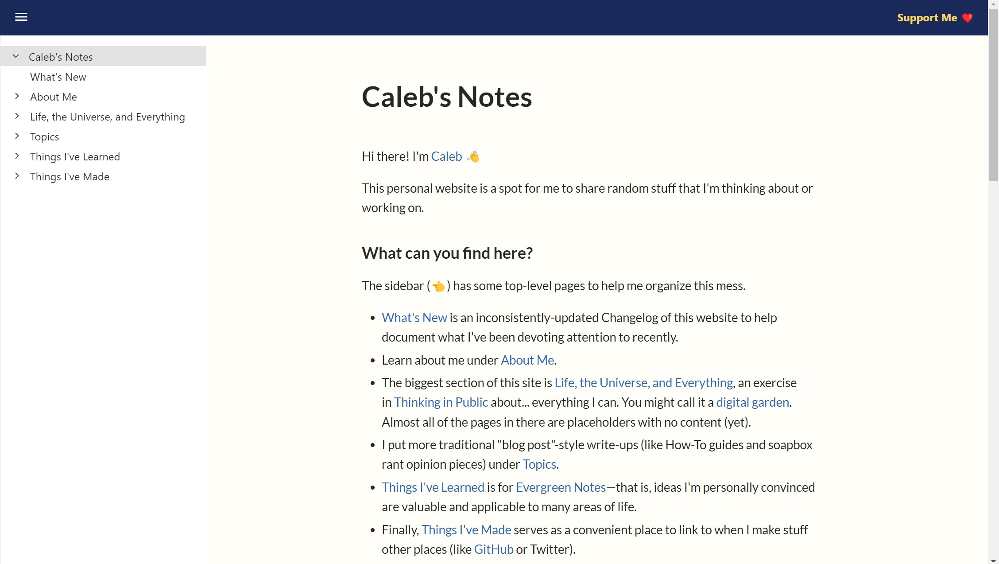

This is now the *third* iteration of a "Caleb's Notes" website to see the light of day. To celebrate, here's a brief summary of this lovable train wreck's messy history.

<!--truncate-->

The first version of "Caleb's Notes" was built using [Gatsby](https://www.gatsbyjs.com/), a static site generator with some extra frills. It looked like this:

I'm not a website designer, so obviously I didn't create all the cool functionality from scratch. For most things, I used a Gatsby plugin called [gatsby-theme-andy](https://github.com/aravindballa/gatsby-theme-andy) to add a couple of features--namely, side-by-side sliding panes, backlinks on each page, and mouse-over previews on links. These features were inspired by [Andy's Working Notes](https://notes.andymatuschak.org/About_these_notes), the [[Digital Garden|Digital Garden]] created by [[Andy Matuschak]] (a former engineer at Apple and self-styled public intellectual). I did my own CSS styling and added a couple of simple features myself (like clickable "copy a link to this page" buttons on each pane). I then hosted the output from Gatsby on [Netlify](https://www.netlify.com).

On that site, I liked the backlinks feature, the ability to connect pages using `[[Wiki Link]]` syntax, and I thought the Andy-Matuschak-style horizontal sliding panes were really neat. I also liked that all the content was written in plain Markdown files and then compiled into HTML by Gatsby. 

I didn't like the steadily-increasing compile time. Once I got north of a couple hundred Markdown files, Gatsby would take close to a minute to re-generate the static site. This made iteration slow and arduous, which killed my enthusiasm for continuing to expand the site. 

For the second version, I moved all the content from the first version onto a platform called [Brick.do](https://brick.do). It looked like this:

Brick.do is a hosted service that provides a web-based editor experience to add and update website content. Its creators pitch it as a super-simple solution for making personal websites, team wikis, or documentation sites as easily as writing Google docs. I ended up doing a significant amount of work to customize the vanilla look and feel of Brick.do, which Brick.do facilitates by allowing user-defined [Sass CSS](https://sass-lang.com/) and HTML header tag injection from within the editor interface.

Initially I wasn't crazy about having a navigation sidebar, since that forced me to organize my notes into a structured navigation tree. But over time I discovered an unexpected benefit: it forced me to organize my notes into a structured navigation tree. 

On Brick.do, I liked that I could freely edit and update pages on the website from any device, including my smartphone. I also ended up preferring the single-page-at-a-time navigation over the Matuschak-style sliding panes.

However, the kinds of notes I want to write are highly hyperlinked and inter-connected. Brick.do has an interface for linking pages to other pages, but I found it clunky to use (especially on mobile). I also found myself wanting to customize the site further than the limited web interface would permit.

What finally put the last nail in the coffin of the Brick.do site is the slow development of the platform and a number of highly upvoted feature requests on their roadmap (like `[[Wiki Link]]` syntax support) that have gone many months without attention. A recent announcement from the developers that they're stepping back from developing the platform further due to lack of profitability makes me further lose interest in dumping more customization time and content onto a platform that doesn't seem to be thriving and could switch off the server any day.

So, the "Caleb's Notes" website is dead, long live the "Caleb's Notes" website!

This now the third version of a personal website. It is implemented on top of Facebook's [[Docusaurus]] static website generator and hosted, again, on Netlify. 

Docusaurus combines a number of benefits that I liked from the two previous versions (Gatsby's Markdown content editing and `[[Wiki Link]]` support, Brick.do's structured sidebar navigation tree). It also addresses a number of the pain points that turned me off from the previous two sites (Gatsby's slow iteration time, Brick.do's limited customization and hosted platform lock-in). 

I don't know whether or how long I'll stick with this platform, or even if I'll finish making the updates that I feel are necessary before I publish this version for public consumption. But, as for this exact moment, I've really enjoyed solving the handful of problems that I have so far in order to have a site that I like the look and feel of (both in the finished product and in the editing experience on the back end).

For more detail about how this website is implemented, see [[This Website]].