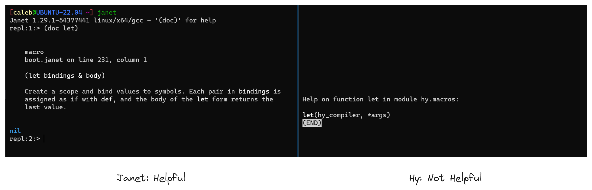

# A Look at Hylang

At work recently, I've been working a good bit with [Hy](https://www.hylang.org), a [[Lisp]]-y alternative syntax for Python. 
    Check out their official website here: [Hylang.org](http://hylang.org)

Here's some thoughts about the language, and a rough comparison between it and my darling indie darling, [Janet](https://www.janet-lang.org).

<!-- truncate -->

## Janet is Great, Just Great

If I had my choice, [[I Love Janet (The Language)|I'd much rather]] use [[Janet]] or even [Clojure](https://clojure.org), but my team at work is familiar with [[Python]] so that makes it the obvious choice in that context. 
    And while Hy is far from perfect, at the very least it's saving me from needing to write [[Python]] directly—for the *most* part—a benefit for which I am *quite* grateful. 😜 

The experience of hacking around with Hy has only increased my [[I Love Janet (The Language)|(already great) appreciation]] for [[Janet]]'s design and included batteries. 
    I haven't needed Janet's [Parsing Expression Grammars](https://janet-lang.org/docs/peg.html) so far (most of what I'm doing is UI automation) but whenever I eventually do, Hy doesn't have a PEG module built in the way Janet does. 
    Janet's event loop and fibers are absent from Hy, which would've been nice-to-have at least once so far. 
    And, Hy has no analog whatsoever of Janet's first-party project manager [JPM](https://janet-lang.org/docs/jpm.html), and I have sorely missed it—so much so, I've started cobbling together my own messy rough equivalent using [PowerShell](https://github.com/PowerShell/PowerShell) scripts. 
    But that obviously just isn't the same. 

Plus, I'm finding out more and more how robust and nicely-designed Janet's core library is by comparison with Hy's. 
    A big difference between the two is `(doc)`.
        In Janet, running `(doc f)` where `f` is any function gives a beautifully formatted, usually-short-and-sweet explanation of the function's arguments, what the expected behavior is, and (in the case of more involved functions/macros) what all the optional parameters are and do.
        If you aren't sure what the name of a function is, `(doc s)` where `s` is any string will search the current environment for symbols matching that string.
        It even works on imports, if the designer of the imported module was thorough in giving docstrings to all their functions!
    
In Hy, the majority of the time `(doc f)` just says, "This is a macro/function, go read the actual docs if you want to know even the most basic things about it."

But this generally higher level of polish and consideration applies to a lot of corners of Janet's core library.
    Janet's `(loop)` and its cousins (`seq`, `tabseq`, and `generate`) are just fantastic core functions for iteration and list/table comprehensions (Hy's equivalents are less powerful and have less consistent syntax between them).
    
And MAN I miss Janet's `;` (aka `(splice)`) when I'm writing Hy. 
	To be fair to Hy, they do have "splat" operators—`#*` for iterables and `#**` for maps—that ostensibly do the same thing as Janet's `splice`.
	But... and honestly I think this is probably on me, not Hy... I've struggled to get them to work properly.
	In particular I've used `#*` in situations that I'm confident would have worked perfectly in Janet, but it only made Hy/Python's interpreter very angry with me.
	(Hy also has an unquote-splice operator that looks like `~@[]` and works similar to Janet's `,;[],` but that's only for use inside of macros, as far as I can tell.)

I could keep going for a long time here—the bottom line is, Janet's core functions are really great.

### So, why bother with Hy at all, then?

If Janet is so great, why don't I just *marry* it??

Well, as stated above, sometimes you *need* to reach for a specific language that isn't your own subjective first choice due to external constraints.
    In my case, Python comes pre-approved for use on work computers (it's part of the self-serve program installation portal that doesn't require intervention from an IT support drone) where most other languages are not.
    
Also, individual preferences diminish in importance when a team needs to be involved.
    I might love writing everything in [Rockstar](https://codewithrockstar.com/) or [Whitespace](https://github.com/Romejanic/Whitespace), and that's great for side projects where the goal is having fun.
    At work, the goal is to get things done.
    In my context, that means using Python.

### Ok, if you *have* to use Python, then why not just... use Python?

The honest answer is, I just *don't want to!*
    
I have three main hang-ups that prevent me from just gritting my teeth and working directly with Python: syntax preferences, editor tooling, and REPL-driven development style.

    
Digression: More on Lisp Syntax, Editor Tooling, and REPL-Driven Development

First, I love **[[Lisp]] syntax.** 
    That probably sounds bizarre and potentially even insane to a certain percentage of programmers out there, but it's the honest truth. 
        I love the consistency of [Polish Notation](https://en.wikipedia.org/wiki/Polish_notation).
        I like the way Lisp programs are *explicitly* just a hierarchical data structure.
    But this is one of the things that Lisp-haters *explicitly* despise, so I'm not expecting to win anyone over; it's just MY preference.

Second, I love **[[Lisp]]-y editor tooling.**
    This is a follow-on feature enabled by Lisp's "parentheses everywhere" syntax.
    Because everything is an explicit nested tree, it's trivially easy for editors to hook into and rearrange Lisp code.
        I use some form of [ParEdit](https://www.emacswiki.org/emacs/ParEdit) everywhere I write Lisp or Lisp-like code. 
            That means I have muscle memory for deeply interacting with the code I write not just at the character level, but at the *structural* level. 
    I've seen some [really awesome work](https://www.masteringemacs.org/article/combobulate-structured-movement-editing-treesitter) on making ParEdit-style editor tooling work for non-Lisp languages, including Python.
        But, that specific project is targeted at Emacs (it may shock you to learn that's not my editor of choice given we're talking about my preference for Lisp, but *c'est comme ça*). 
        And beyond that (while I haven't tried it myself or anything) I can't imagine that approach *not* being spoiled at least a little bit by Python's fundamentally less-consistent syntax.

But finally, I love **interacting with the code I write in a live REPL,** the runtime state of which "follows me around" as I'm figuring things out.
    Python actually comes very close to having REPL-driven workflow possibilities due to being an entirely interpreted language.
        IDLE is not *quite* the same thing as a true Lisp REPL.
        But, it's close enough for most purposes, and the approach of using Notebooks (which is pretty universal in Python) closes most of the rest of the gaps that practically matter to me.
    But, again thanks to Lisp's parentheses, it's just *even easier* to work with a REPL in a live file when you're writing a program in Lisp. 
        Suppose you have a deeply nested function and you want to evaluate just one part of it to make sure it's giving back the results you expect. 
        It's trivially easy to just evaluate the *one expression* you're interested in, regardless of line breaks or shared space with other code, because every expression is explicitly delimited not by line breaks or semantic whitespace, but by the parentheses that surround it.

Final Note: some people's love for a language lives or dies based on the ability to write first-class macros in that language.
    I definitely appreciate the power of macros, but I have seldomly encountered situations in my own use where a macro has solved more problems than it has created (due entirely to my inexperience with them, but still).
    So for me, that feature does not rank in the top three reasons I prefer [[Lisp]].

All that to say, I do prefer [[Lisp]].
    So, do I like Hylang?
    Well, yes and no.

## Rough Edges of Hylang

Hy unavoidably inherits a number of rough edges from Python. 
    **Everything in Hy is mutable always**, for one—even function argument default values, which [Python also persists!—in their mutated state!—between different calls to the same function](https://docs.python-guide.org/writing/gotchas/#mutable-default-arguments) (just... **_WHY?!?!_** When would this _EVER_ be a desirable behavior???).
    
For another, since Python conventionally embraces OOP, Hy's **facilities for working with plain ol' data structures** are (IMHO) less refined than Janet's.
    For example, there is no `(update)` function for changing the values in dictionaries "in-place" by applying a function to whatever value is already there (Python dictionaries do have an `.update` method, but that works like Janet's `(merge)`, not `(update)`). 
    Hy could do more to alleviate this (and, in fact, several of the functions I miss are provided in [Hyrule](https://hyrule.readthedocs.io/en/master/#), Hy's first-party expansion to the standard library). 
    But at the moment, and in my as-yet still limited experience of using both, Janet is just stronger in this regard than Hy.
    
For a third, Python's approach to **dynamic typing** means you don't learn much about your Hy program (particularly, things that are wrong with it) **at compile time.** 
    Janet is much better in this regard. 
        While Janet itself is also a dynamic language, compiling down to C—a statically-typed language—gives Janet FAR more compile-time insight than Hy has access to. 
        Janet will simply refuse to compile a function with a reference to an undefined symbol, for example. 
        But with Hy, you have to actually _call the function at run time_ **(!)** before you hit basic errors like that. 
        Which means, if your program has a highly branching structure (like mine often do) and some branches are just used less than others, you could easy introduce a fatal exception in a seldom-used part of the program and go a _really long time_ without even noticing. 🙄 
        (Yes, I do know that this is what tests are for. The point stands.)

A final really important difference is the **community experience.** 
    While Janet's community is small and not _hugely_ active, the community around Hy is (as far as I can tell) all but non-existent. 
        I went looking and wasn't able to find anywhere to just hang out and share thoughts and collaborate on problems around Hy. 
        The language's creator and maintainer is active on GitHub discussions in Hy's main GitHub repo, but the vibe there is very "stick to business" and asking newbie questions or sharing discoveries or workshopping solutions to problems there feels off-topic and disruptive.
            I don't want to clutter up somebody else's "get stuff done" workspace with my dumb "I'm trying and failing to do a very basic thing" nonsense.

## Hylang's Advantages

But, it's not at all a one-sided "Janet is the universally superior language" kind of story. 
    Hy has several genuine merits, some of which are really huge.
    
The _biggest_ thing for me is the deciding factor for why I'm using Hy at work at all, and that is, **my team knows Python and they don't know Janet.** 
    The practical reality is, collaborating with others requires everyone to at least have access to the same language—and Hy gives me access to Python without needing to get deep into Python's inner workings.
    I can pretty quickly slap together what I need in Hy, transpile that to Python, tweak the output by hand just a little bit (if needed, sometimes I don't even have to do that), and I'll wind up with reasonable, working Python code that I *don't have to deeply understand.*
    That's a huge Win.
    
A related benefit is access to Python's **gigantic library ecosystem.** 
        Python libraries _just work_ with Hy—whether it's pandas, matplotlib, Oracle first-party database drivers, super cool and useful TUI libraries like [PyInquirer](https://github.com/CITGuru/PyInquirer), libraries for extracting data from PDFs, libraries for interfacing with Word docs and Excel spreadsheets, desktop automation libraries, a huge array of test runners and test-support libraries, even stuff for machine learning and computer vision (though I haven't reached for any of those myself just yet)—you name it, Hy can tap into it. 
        Coming from Janet, which has honestly less than a dozen _truly_ well-done and fully developed libraries, this has been a _huge_ benefit. 
    
It's also been easier, in my experience, to **get Hy working (as well as it can) on Windows.** 
    Janet has Windows support, but it is generally a \*nix-first project. 
        This is partly due to C/C++ support in general on Windows being much more convoluted and unfriendly (in my brief experience) than on, for e.g., Linux. 
            MSVC (the first-party supported C compiler for Windows) requires a 7 _GIGABYTE_ install, and that's just for the command line utilities—the full "happy path" install of MSVC includes an entire Visual Studio installation. 
            Then, in order to *use* the stupid thing, you have to do all your C compilation stuff inside of a dedicated MSVC shell, if not, again, in a full install of Visual Studio.
                Doing it that way probably solves a number of build environment and dependency tracking issues, to be fair to Microsoft.
                But for *me* (a totally inexperienced newbie programmer who is way more used to Linux) it just feels *obnoxiously* involved and heavy.
                    (I think true \*nix/BSD chads call this "bloat.")
        
By contrast on the C + Linux side, pretty much every Linux distribution comes with GCC pre-loaded, and several others (CC, clang) in the default package repositories. 
    And with any of the above, you can just use them from the command line or in ordinary shell scripts no problem. 
    And, by contrast on the Python + Windows side, Python support on Windows is quick and comparatively light-weight. 
    You just get Python installed and you're off to the races with plain `.py` script files (admittedly distribution is more of a challenge, but libraries like [PyInstaller](https://pyinstaller.org/en/stable/) help with that).
    It's just where you try to do C + Windows that problems come up (and, IME, come up quickly).

I must also say, while Hy doesn't have the same community fabric as I have enjoyed in Janet-land, **Hy has been around longer** and there are _many_ **more people using it** out in the wild than seem to be using Janet. 
    That has led to some cool projects being developed for Hy that Janet has no comparable equivalents to—one example being [Calysto Hy](https://github.com/Calysto/calysto_hy), a (mostly functional) Jupyter Notebook kernel for Hy.
    So, if Janet's community beats Hy's, Hy's ecosystem (both tapping into Python and interesting Hy-native stuff) handily outstrips Janet.

## Not So Different After All?

But one thing that Janet and Hy seem to agree on is (relatively) **neglecting editor support for VS Code** (my byte-sequence-on-hard-drive updating interface of choice)!
    I'm on a one-man mission to remedy both cases—check out [hylang/vscode-hy](https://www.github.com/hylang/vscode-hy) and [CFiggers/vscode-janet-plus-plus](https://www.github.com/CFiggers/vscode-janet-plus-plus), two very similar projects where I'm hacking my favorite parts of Clojure's [betterthantomorrow/Calva](https://www.github.com/betterthantomorrow/Calva) into Hy and Janet, respectively. 
    Issues and PRs are welcome on both!
